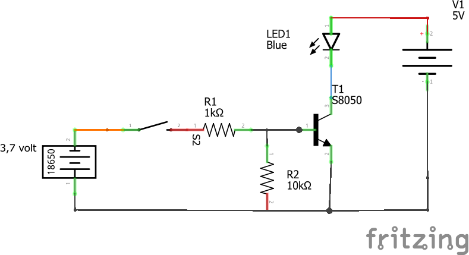
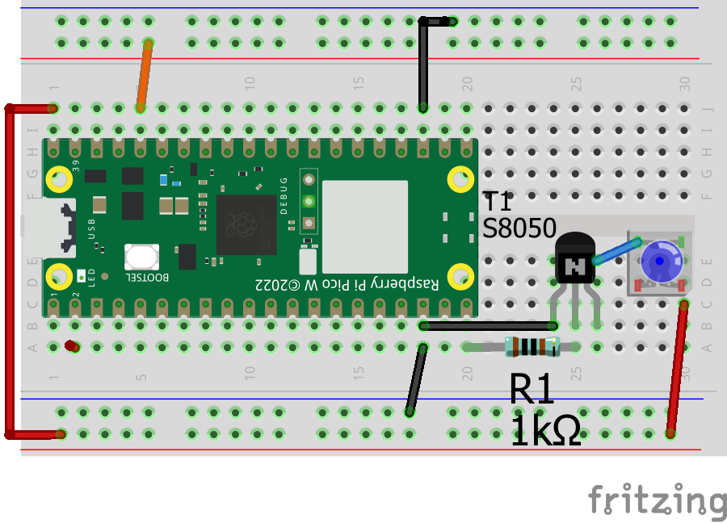
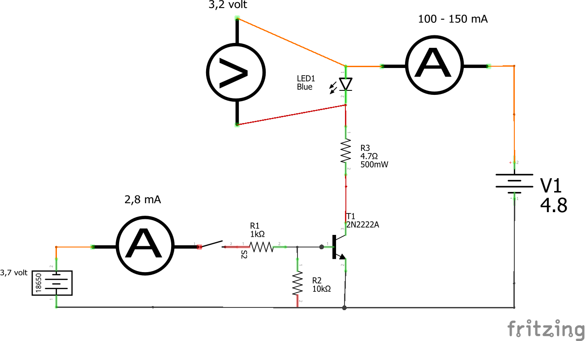

# CL14-uP: Transistor y Proyecto Dodow sueño >draft<

Forma parte de la serie '**Workshop about Python and micropython with Pico W in CMM Benito**' Martin Madrid

## Clase 14 - Indice - 90 minutos

- 0.Objetivo

- 1.Tutoriales, Programas, Conexionado y Librerias

- 2.Entender circuito de transistor

- 3.Proyecto Dodow - ayuda para el sueño

## 0. Objetivo

Para acabar el curso un pequeño proyecto que se puede continuar en vacaciones:

Vamos a hacer un prototipo de un aparato que ayuda a conciliar el sueño , 'Dodow' : se trata de sincronizar la respiración con la luz de un led pulsante. La idea es ir bajando de ritmo de la pulsación de luz desde 11 ciclos por minuto  (subir brillo = inspiración-> bajar brillo = expiracion)  a 6 ciclos por minuto. El aparato comercial tiene dos secuencias :

- Larga 20 minutos desde las 11 respiraciones pro minuto a las 6 respiraciones

- Corta de 8 minutos también desde 11 a 6 respiraciones por minuto

[Dodow web oficial | Duérmete más rápido | Pruébalo 100 días](https://www.mydodow.com/dodow/es-es/bundles)

[Dodow : découvrez comment il va vous endormir. - YouTube](https://youtu.be/kY5L8FCDVtc)

Como se ve, el Dodow comercial usa un luz azul pulsante. Vamos a necesitar un led azul de potencia de 1w . Para controlarlo usaremos PWM cambando esta vez el ciclo de trabajo (No la frecuencia), pero necesitamos bastantes miliamperios (+ de 100 mA ) con lo que usaremso un circuito de transistor

## 1. Tutoriales, Programas que vamos a usar y conexionado

### Tutoriales resumen

**PWM y led**

[Fade In and Out - Learning MicroPython](https://dmccreary.github.io/learning-micropython/basics/04-fade-in-and-out/)

Del **Dodow do it yourself**  hay tutoriales, pero para leguaje arduino

-     [DIY Dodow Clone Arduino Sleep Meditation Machine : 4 Steps (with Pictures) - Instructables](https://www.instructables.com/DIY-Dodow-Clone-Arduino-Sleep-Meditation-Machine/)

-     [GitHub - dshiffman/dodowDIY: An ATTiny85 implementation of the well known sleep aid. Includes circuit, software and 3d printed case design](https://github.com/dshiffman/dodowDIY/tree/main)

Del **transistor BJC**: 

- un buen tutorial [Transistor bipolar BJT y Arduino](https://programarfacil.com/blog/arduino-blog/transistor-bipolar-bjt-npn/)

- Del libro Electrónica para makers Guía completa' de Paolo Aliverti, leer el capitulo 'El transistor bipolar'

- El tutorial de sunfounder sobre transistores NO es muy bueno
  
  [Transistor — SunFounder Kepler Kit for Raspberry Pi Pico W 1.0 documentation](https://docs.sunfounder.com/projects/kepler-kit/en/latest/component/component_transistor.html)

----

### Tabla resumen de programas

Ningún programa necesita hw adicional

| Programa                                                 | Lenguaje | Objetivo de Aprendizaje                                                                            |
| -------------------------------------------------------- | -------- | -------------------------------------------------------------------------------------------------- |
| [R2425_ExPWM_indutty.py](R2425_ExPWM_indutty.py)         | uPy      | Test básico de PWM y conexiones                                                                    |
| [R2425_Dodow1respL1ms1_0.py](R2425_Dodow1respL1ms1_0.py) | uPy      | 1ciclo de respiración Lineal , paso 1ms                                                            |
| [FuncRespL1ms2_0.py](FuncRespL1ms2_0.py)                 | uPy      | 1ciclo de respiración Lineal , paso 1ms & puesta en modo función para importar                     |
| [R2425_DodowIR2_0.py](R2425_DodowIR2_0.py)               | uPy      | Programa dodow completo v2.0 usa funciones de respirar , IR = importa respirar -> lineal 1ms       |
| [FuncRespLPAS2_0.py](FuncRespLPas2_0.py)                 |          | 1ciclo de respiración Lineal , 500 pasos & puesta en modo función para importar                    |
| [FuncRespLG1ms2_0.py](FuncRespLG1ms2_0.py)               |          | 1ciclo de respiración Lineal , paso 1ms + Corrección Gamma & puesta en modo función para importar  |
| [FuncRespLGPAS2_0.py](FuncRespLGPas2_0.py)               |          | 1ciclo de respiración Lineal , 500 pasos + correccion Gamma& puesta en modo función para importar  |
| [R2425_DodowIR2_p.py](R2425_DodowIR2_p.py)               |          | Programa dodow completo v2.0 usa funciones de respirar , IR = importa respirar -> lineal 500 pasos |

## Conexionado circuito test de transistor



### Conexionado circuito Dodow

Es muy parecido al conexionado de la CL13 sonido. de nuevo el elemento d epotencia se alimenta a +5vol del usb

TODO : comentar como seri aun alimentación autónoma



### Librerias

No usaremos ninguna libreria.

## 2. Entender el circuito de transistor

Un buen tutorial para entender el uso de transistores BJC en modo corte-saturación es

[Transistor bipolar BJT y Arduino](https://programarfacil.com/blog/arduino-blog/transistor-bipolar-bjt-npn/)

o leer el capitulo 'El transistor bipolar' del libro 'Electrónica para makers Guía completa' de Paolo Aliverti

Vamos a medir voltajes y corrientes en distintas partes del circuito, especialmente corrientes en el circuito de base-emisor y el de emisor-colector-led



Estos son algunos valores reales hallados por mi.  Cuidado he usado un transistor2n2222A porque tengo mas de estos !!! De la hoja de datos

Vbe = 0.6 a 1.2 volt

Vce = 0.3 a 1.0 volt

==> Haz el montaje y mide los valores

APRENDIZAJES:

* Cuando necesitamos controlar dispositivos que consumen > 20mA este montaje de transisitor en corte-saturación es muy útil

* Se pueden controlar con la Pico ( lógica a 3,3 volt) dispositivos con mucho mas voltaje, usando este montaje de transistor BJC en corte - saturación

## 3.Proyecto Dodow - ayuda para el sueño

### Planteamiento y seguimiento

Una vez que hemos resuelto el problema del HW : 

    Ya sabemos como **dar mucha corriente a un Led azul de potencia** que puede llegar a consumir unos 300mA ( en realidad consume unos 120 mA), 

hay que ver como abordar el proyecto Sw de micropython. Veo estas partes 

- [x] A-Sabemos como **cambiar la luz del led usando el ciclo de trabajo de un pulso PWM**
  
  - [x] Necesitamos un programa de test 

- [ ] **B. Ciclo de respiración Lineal** = subir la luz del LED y luego bajarla
  
  Probemos con 10 respiraciones por minuto  & Subida y bajada lineal + un reposo : 3 + 6 +1 por ejemplo. Tenemos 2 posibilidades:
  
  - [x] por cambio cada **1msegundo**
  
  - [x] por **numero fijo de pasos**
  
  - [ ] ¿Cuál es mejor ?

- [ ] C.  **Problema de percepción**: El ojo humano percibe de forma logarítmica un cambio lineal -> hay que usar una función exponencial ( función gamma) contraria a la función logarítmica. 
  
  Ver [PWM Exponential LED Fading on Arduino (or other platforms) | Diarmuid.ie](https://diarmuid.ie/blog/pwm-exponential-led-fading-on-arduino-or-other-platforms/)
  
  La solución mas sencilla la he encontrado aqui
  
  [The problem with driving LEDs with PWM &#8211; codeinsecurity](https://codeinsecurity.wordpress.com/2023/07/17/the-problem-with-driving-leds-with-pwm/)
  
  - [x] 1 respiración con hecha por pasos de 1ms Y función gamma
  
  - [x] 1 respiración hecha con N pasos Y función gamma

- [ ] D. **Secuencia de respiraciones** = dos bucles for
  
  - [x] Respiración basica lineal 1ms
  
  - [x] Respiración básica 500 pasos
  
  - [ ] Respiracion 1ms x paso y funcion gamma
  
  - [ ] Respiracion N pasos y funcion gamma
  
  - [ ] ¿ cual es mejor?

-----------------------

### 3.A. Test del HW : cambiar la luz del led usando el ciclo de trabajo de un pulso PWM

[R2425_ExPWM_indutty.py](R2425_ExPWM_indutty.py)

### 3.B. Ciclo de respiración Lineal = subir la luz del LED y luego bajarla

#### 1 respiración- Un cambio por cada 1ms - programa en bruto

Inspiración : 

    Calculamos el tiempo de subida en ms => obtenemos el incremento de pwm en cada ms

    Bucle for que incrementa el ciclo de trabajo del led cada 1ms

Expiracion: idem

Reposo : hemos definido un cliclo de respiracion 3-6-1, con 1 decimo en reposo al final

Ver [R2425_Dodow1respL1ms1_0.py](R2425_Dodow1respL1ms1_0.py)

Si vemos el rastro dejado por la función en modo debug=True, los extremos no estan bien pegados, porque los bucles for no acaban en maxpwm ni en minpwm respectivamente, pero a 'ojo' no se ve del todo mal

```
Inicio duty_u16 = 500
Inspira incre x ms 36 x dura ms 1800
Fin up duty_u16 = 65300 Ultimo paso= 1800
Expira decre x ms 18 x dura ms 3600
Fin down duty_u16 = 700 Ultimo paso= 3600
Reposo dura ms 600
Fin resp duty_u16 = 500
```

#### Una respiración- Un cambio por cada 1ms - como función

<u>Objetivo : Añadir modularidad</u>

Si organizamos el programa de forma **que sea importable** la función de respirar, cuando hagamos el dodow completo solo tendremos que importar la función de respirar, y podremos probar distintas posibilidades de hacer una respiración

**¿Como?** 

Colocamos toda la parte 'main' del programa de 1 respiración en un if especial

```
if (__name__ == '__main__'):
    EXT_LED_PIN = 15
    DEBUG = True

    pwmLed = PWM(Pin(EXT_LED_PIN))
    pwmLed.freq(1000)
    pwmLed.duty_u16(MINPWM)
.......
```

Asi conseguimos que ese codigo SOLO se ejecute si este fichero es el progrma principal 

ver [explicación sencilla](https://ellibrodepython.com/modulos-python#m%C3%B3dulos-y-funci%C3%B3n-main) / explicación mas compleja [__main__ — Entorno de código de nivel máximo &#8212; documentación de Python - 3.10.17](https://docs.python.org/es/3.10/library/__main__.html)

**Resultado**

[FuncRespL1ms2_0.py](FuncRespL1ms2_0.py) ==> debe subirse la memoria de la PICOW

También hemos añadido una salida de la función de respirar que indique que tipo de ciclo de respiración utiliza `return 'Respiracion Lineal 3_6_1'`

### D. **Probamos ->Secuencia de respiraciones** con Función respira L1ms

Aunque el pegado no sea perfecto y tengamos un problema de percepción de la luminosidad, podemos probar una versión de Dodow que use las funciones de respirar

[R2425_DodowIR2_0.py](R2425_DodowIR2_0.py)

La importación la hemos hecho de forma que solo habrá que cambiar 1 linea en todo el programa dodowIR :

```
from FuncRespL1ms2_0 import respiraL1ms as respiraLed # immporta respiraLed
....

# el uso NO hay que cambiarlo

TipResp = respiraLed(pwmLed, durarepsactualms)
```

--------------------------------- FIN provisional -------------------------------

todo : incluir en funciones de respiración secuencia de inspira-expira-reposo como tupla
